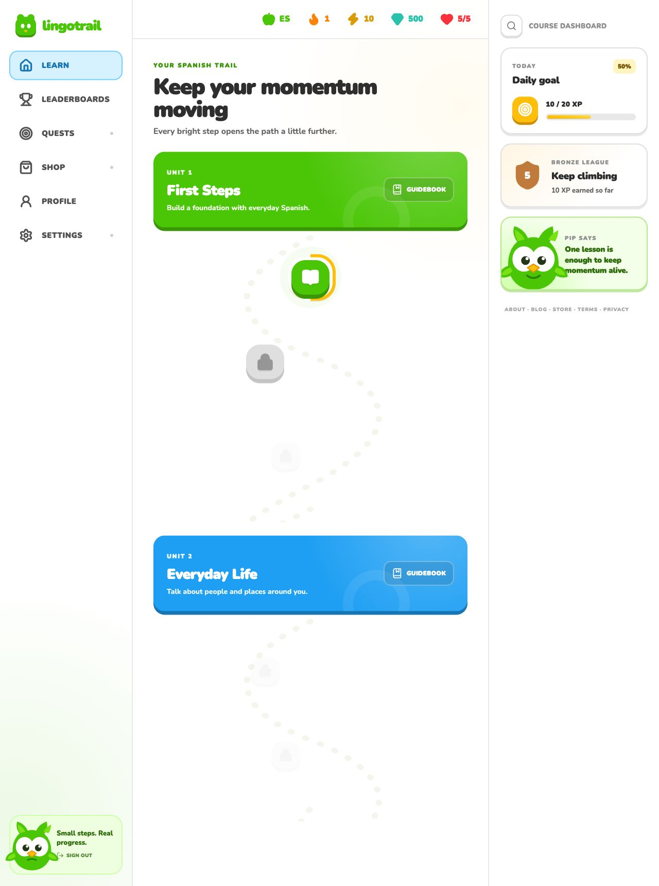
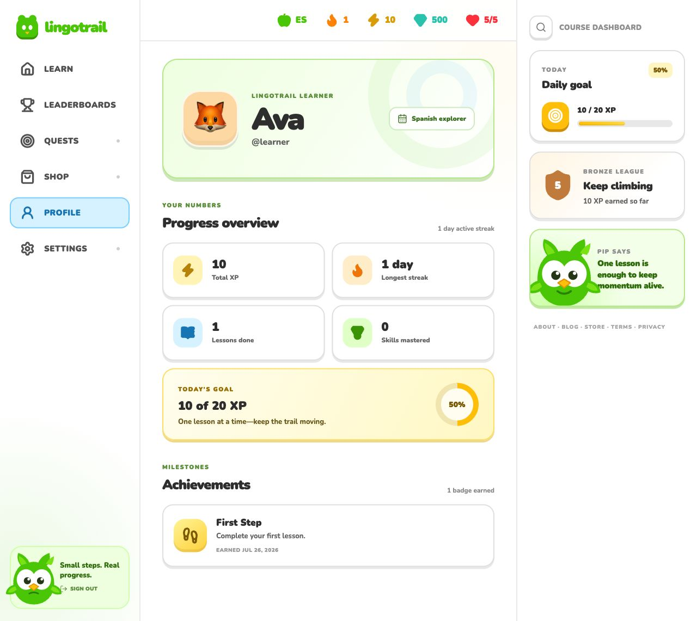
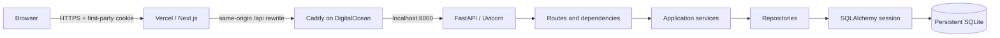
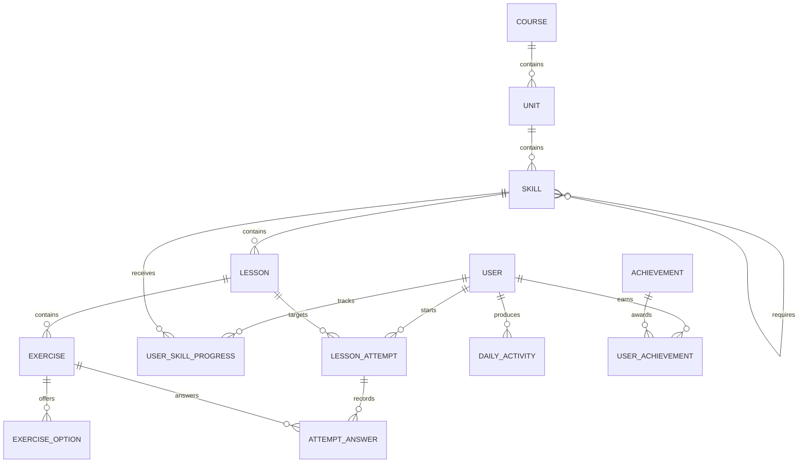
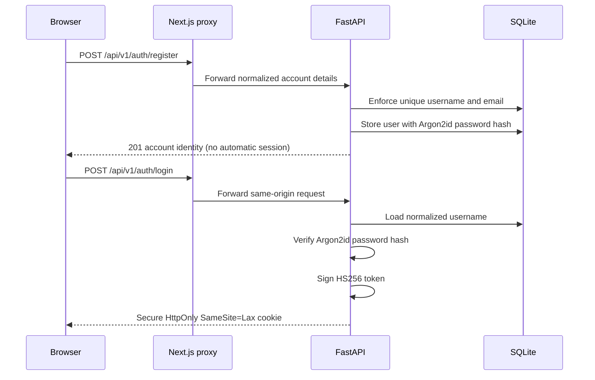
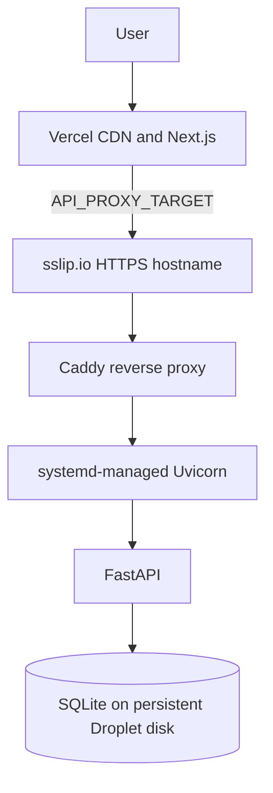

<div align="center">
  

  <h1>LingoTrail — Language Learning Platform</h1>

  <p>
    A full-stack, Duolingo-inspired learning experience with secure
    authentication, five interactive exercise formats, persistent progress,
    gamification, and a production-ready deployment workflow.
  </p>

  <p>
    <a href="https://lingotrail-scaler.vercel.app"><strong>Live demo</strong></a>
    ·
    <a href="https://lingotrail-api-139-59-18-245.sslip.io/api/v1/health"><strong>API health</strong></a>
    ·
    <a href="https://github.com/ashishbaberwal/duolingo-clone"><strong>Repository</strong></a>
  </p>

  <p>
    
    
    
    
    
    
    
  </p>
</div>

---

## Table of contents

- [Try the application](#try-the-application)
- [Assignment coverage](#assignment-coverage)
- [Overview](#overview)
- [Product walkthrough](#product-walkthrough)
- [How to use LingoTrail](#how-to-use-lingotrail)
- [Key features](#key-features)
- [Technology stack](#technology-stack)
- [System architecture](#system-architecture)
- [Core business logic](#core-business-logic)
- [Database design](#database-design)
- [Authentication and security](#authentication-and-security)
- [API documentation](#api-documentation)
- [Repository structure](#repository-structure)
- [Local setup](#local-setup)
- [Testing and quality](#testing-and-quality)
- [Production deployment](#production-deployment)
- [Engineering decisions and trade-offs](#engineering-decisions-and-trade-offs)
- [Technical questions and answers](#technical-questions-and-answers)
- [Scaling beyond the assignment](#scaling-beyond-the-assignment)

## Try the application

| Item | Value |
| --- | --- |
| Application | [https://lingotrail-scaler.vercel.app](https://lingotrail-scaler.vercel.app) |
| New account | Open `/signup`, enter your details, then sign in |
| Backend health | [Public health endpoint](https://lingotrail-api-139-59-18-245.sslip.io/api/v1/health) |
| Local API documentation | `http://localhost:8000/docs` |

There is no shared default learner. Every evaluator creates an independent
account whose password is stored only as an Argon2id hash. XP, hearts, streak,
skill progress, attempts, achievements, and leaderboard rank then follow that
authenticated user.

## Assignment coverage

| Evaluation area | Implementation |
| --- | --- |
| Learning path | Ordered units and skills with completed, available, and locked states, progress rings, crowns, and prerequisite-based unlocking |
| Lesson experience | Multiple choice, word bank, match pairs, fill-in-the-blank, and typed-answer exercises with immediate server-validated feedback |
| Gamification | Persistent hearts, XP, streaks, daily goal, gems, crowns, leaderboard position, and automatically awarded achievements |
| Persistence | Learner accounts, lesson attempts, answers, daily activity, skill progress, and rankings stored in a relational SQLite schema |
| Authentication | Independent signup and login, Argon2id password hashes, signed sessions, and Secure HttpOnly cookie support |
| Product UI | Original LingoTrail identity, Pip mascot, animated outcomes, completion celebration, placeholders, and responsive styling |
| Engineering quality | Feature-based frontend, layered backend, migrations, seed service, typed contracts, error states, and a single Turborepo quality gate |
| Delivery | Vercel frontend, DigitalOcean backend, Caddy HTTPS, systemd supervision, GitHub Actions deployment, and operational documentation |

## Overview

### Problem statement

Language-learning products need more than static lesson pages. A useful learning
loop must coordinate:

- ordered course content and prerequisite-based unlocking;
- several exercise formats with immediate feedback;
- resumable attempts, hearts, XP, streaks, goals, and achievements;
- learner-specific persistent progress;
- secure answer evaluation that the browser cannot manipulate;
- clear loading, error, empty, locked, failure, and completion states.

### Solution

LingoTrail implements that loop as a full-stack application:

```text
Choose an available lesson
→ start or resume an attempt
→ submit one answer at a time
→ receive server-validated feedback
→ lose hearts on mistakes
→ complete the lesson transaction
→ earn XP and update streak/progress
→ unlock the next skill
```

The frontend owns presentation and temporary interaction state. FastAPI owns
answers, progression, attempts, hearts, XP, streaks, achievements, and
rankings. SQLite persists the result for each learner.

## Product walkthrough

### Learning path

The learning path displays ordered units, available and locked skills, lesson
progress, the daily goal, league position, hearts, gems, XP, and streak.



### Learner profile

The profile combines identity, total XP, streak history, completed lessons,
daily-goal progress, and earned achievements.



## How to use LingoTrail

1. Create an account with a unique username and email address.
2. Sign in with the credentials used during registration.
3. Open the first available skill on the learning path.
4. Complete each exercise and use the immediate feedback to continue.
5. Preserve hearts by answering carefully or use the mocked refill after
   running out.
6. Finish lessons to earn XP, update the daily streak, and unlock later skills.
7. Review learner-specific statistics on the profile and compare XP on the
   leaderboard.

Progress belongs to the authenticated account, so signing in as another learner
produces a separate path, heart balance, streak, attempt history, and rank.

## Key features

### Learning experience

- Winding course path grouped into units and skills
- Prerequisite-based `completed`, `available`, and `locked` states
- Five exercise types:
  - multiple choice;
  - translation with a word bank;
  - match pairs;
  - fill in the blank;
  - typed answer
- Immediate correct and incorrect feedback
- Resumable lesson attempts
- Lesson progress and completion celebration
- Out-of-hearts state with mocked refill

### Gamification

- Persistent hearts and maximum-heart enforcement
- XP awarded on lesson completion
- Current and longest streak
- Daily XP goal
- Gems and crowns
- Seeded league leaderboard
- Automatically awarded First Step, XP Explorer, Week Warrior, and Perfect
  Lesson badges with one-time XP bonuses

### Product quality

- Original LingoTrail identity and Pip mascot
- Modular feature-based frontend structure
- Responsive desktop, tablet, and mobile CSS
- Accessible labels, navigation, feedback, and progress indicators
- Recoverable API errors and deliberate loading states
- Settings, Quests, Shop, Search, and Guidebook placeholders with visible
  feedback

### Backend integrity

- Correct answers never appear in public lesson payloads
- One answer per exercise per attempt
- Exercise-order enforcement
- Attempt ownership checks
- Database constraints for XP, hearts, positions, and relationships
- Atomic lesson completion
- Idempotent migrations, attempt creation, and seed data

## Technology stack

| Layer | Technology | How it is used | Why it fits |
| --- | --- | --- | --- |
| Monorepo | Turborepo 2, pnpm workspaces | Runs lint, type-check, test, build, and development tasks from the repository root | One workflow and dependency-aware caching without mixing JavaScript and Python dependency management |
| Frontend | Next.js 16, React 19, TypeScript | App Router pages, route protection, client interactions, and production builds | Strong routing and deployment model with typed React development |
| Server state | TanStack Query 5 | Queries, mutations, caching, cancellation, retries, and invalidation | Server data stays separate from transient component state |
| Styling | Tailwind CSS 4, CSS Modules | Global utility foundation plus locally scoped feature styles | Shared tokens without leaking feature-specific selectors |
| Interaction | Motion, Lucide React | Feedback transitions, completion states, and accessible icons | Small focused libraries instead of a heavy UI framework |
| Backend | FastAPI, Python 3.12, Pydantic | Versioned REST API, dependency injection, validation, cookies, and OpenAPI | Concise typed APIs with automatic contract documentation |
| ORM | SQLAlchemy 2 | Models, relationships, queries, and transaction boundaries | Explicit relational mapping and mature unit-of-work behavior |
| Migrations | Alembic | Versioned, reversible schema history | Production schema changes are reviewed instead of generated at runtime |
| Database | SQLite | Course content, users, progress, attempts, and achievements | Correct scope for a single-server assignment and simple reproducible setup |
| Authentication | Argon2id, PyJWT, HttpOnly cookies | Password verification and signed eight-hour sessions | Passwords remain hashed and tokens remain unavailable to browser JavaScript |
| Python tooling | uv | Locked environments, scripts, and backend builds | Fast deterministic installation using `uv.lock` |
| Quality | Vitest, Testing Library, pytest, Ruff, MyPy, ESLint | Behavior, accessibility, typing, linting, migrations, and builds | Tests both user-visible behavior and backend domain rules |
| Hosting | Vercel, DigitalOcean, Caddy, systemd | Frontend CDN, persistent backend VM, HTTPS, and process supervision | Matches the split frontend/backend architecture while preserving SQLite |

### Why pnpm and uv are both present

They solve different dependency problems:

- pnpm owns JavaScript dependencies and workspace orchestration.
- uv owns the Python interpreter environment and Python lockfile.
- Turborepo invokes backend adapter scripts from `backend/package.json`, but it
  does not install Python packages.

This gives one root developer workflow without pretending the two ecosystems
use the same package manager.

## System architecture



### Backend layer responsibilities

```text
Route
  translates HTTP input and domain failures
    ↓
Pydantic schema
  validates request and response contracts
    ↓
Service
  owns the use case and business rules
    ↓
Repository
  owns reusable loading and persistence queries
    ↓
SQLAlchemy session
  provides one transaction boundary
    ↓
SQLite
  enforces final relational integrity
```

Routes do not calculate XP or unlock skills. Repositories do not return HTTP
responses. This separation makes rules testable without coupling them to the
transport layer.

### Frontend data flow

```text
App Router page
→ feature page
→ TanStack Query hook
→ typed API client
→ FastAPI response
→ focused presentational components
```

TanStack Query owns remote state. React component state owns only short-lived
input such as selected words, matched pairs, or whether the password is
visible.

### Same-origin production proxy

The browser requests:

```text
https://lingotrail-scaler.vercel.app/api/v1/path
```

Next.js rewrites it server-side to:

```text
https://lingotrail-api-139-59-18-245.sslip.io/api/v1/path
```

The browser therefore sees one origin. This keeps the session cookie
first-party and avoids exposing deployment topology in the client bundle.

## Core business logic

### Skill unlocking

A skill is:

```text
completed
  when the learner's progress row is complete

available
  when it is explicitly unlocked, has no prerequisites,
  or every prerequisite is complete

locked
  otherwise
```

Lock state is calculated per learner. It is not a static column on the skill
because two learners can be at different points in the same course.

### Answer privacy and validation

Lesson responses exclude canonical answers, correctness flags, explanations,
and match-pair keys. The browser submits only the learner's answer.

FastAPI then:

1. verifies the attempt belongs to the authenticated learner;
2. verifies the attempt is still in progress;
3. verifies the submitted exercise is the next expected exercise;
4. validates the answer shape for the exercise type;
5. evaluates it against private database content;
6. records the submitted answer exactly once;
7. returns learner-safe feedback.

This prevents changing frontend JavaScript from becoming a way to award XP.

### Hearts

- A wrong answer reduces both the learner's persistent hearts and the attempt's
  remaining-heart snapshot.
- Hearts never fall below zero.
- Reaching zero marks the attempt as failed.
- Refilling restores the learner to `max_hearts`.
- A failed attempt remains an audit record; retrying creates a new attempt.

### Lesson completion transaction

The final correct or incorrect submission completes one database transaction:

```text
record final answer
→ close attempt
→ award lesson XP
→ update daily activity
→ update streak
→ advance skill progress
→ award newly eligible achievements
→ commit once
```

If any operation fails, the transaction rolls back instead of leaving partial
XP or progress.

### Achievement awards

Achievement rules run only after the current lesson has updated XP, streak, and
progress, so each decision sees the final transaction state:

| Achievement | Rule | Bonus |
| --- | --- | ---: |
| First Step | Complete the first distinct lesson | 5 XP |
| XP Explorer | Reach 100 total XP | 10 XP |
| Week Warrior | Reach a seven-day streak | 15 XP |
| Perfect Lesson | Complete a lesson with no wrong answers | 10 XP |

The learner/achievement pair is unique in SQLite, preventing duplicate rewards.
Bonus XP updates both total XP and the current daily goal. Newly earned badges
appear in the lesson celebration immediately and remain visible on the Profile.

### Preventing accidental duplicate rewards

Before advancing skill progress, the backend checks whether the learner has
already completed that lesson. Practice attempts can still complete, but they
do not increment the skill's completed-lesson count again. A deliberate
practice attempt can earn XP, while duplicate submissions to the same closed
attempt are rejected.

### Streak logic

Activity is stored by learner-local calendar date:

- activity on the same date keeps the streak unchanged;
- activity one day after the last active date increments it;
- a larger gap resets it to one.

Passing the activity date into the service makes the rule deterministic and
easy to test without mocking the operating-system clock.

### Leaderboard ranking

```text
total_xp descending
→ username ascending
```

The secondary sort produces deterministic ranks when learners have equal XP.
The backend returns explicit ranks and marks the current learner, so the
frontend does not recreate ranking rules.

## Database design

The schema separates reusable course content, mutable learner state, and the
attempt audit trail.



### Important constraints

- Unique positions within each parent keep the learning path ordered.
- A skill cannot list itself as a prerequisite.
- One progress row exists per learner and skill.
- One daily-activity row exists per learner and local date.
- One answer exists per attempt and exercise.
- Hearts cannot be negative or exceed `max_hearts`.
- XP, crowns, counts, and positions cannot be negative.
- Foreign keys are explicitly enabled for every SQLite connection.
- Cascades remove records owned by a deleted parent.

### Why not store everything as JSON

JSON is useful for small exercise-specific answer structures, but the main
domain is relational:

- prerequisites are graph edges;
- attempts belong to learners and lessons;
- answers belong to attempts and exercises;
- achievements are reusable definitions;
- progress requires uniqueness and referential integrity.

Normalized tables let the database enforce these relationships. JSON is used
only where exercise types genuinely have different small payload shapes.

## Authentication and security

### Registration and login flow



### Session token claims

The signed token includes:

- `sub`: learner ID;
- `iat`: issued-at time;
- `exp`: expiration time;
- `iss`: expected issuer;
- `aud`: expected audience.

Decoding requires every claim and allows only the configured HS256 algorithm.

### Cookie properties

| Property | Purpose |
| --- | --- |
| `HttpOnly` | Browser JavaScript cannot read the token |
| `Secure` in production | Cookie is sent only over HTTPS |
| `SameSite=Lax` | Reduces cross-site request exposure |
| `Path=/` | Session applies to learner routes and APIs |
| Eight-hour expiry | Bounds the lifetime of a leaked session |

### Timing-conscious password verification

When a username does not exist, the backend still verifies the supplied
password against a dummy Argon2 hash. This reduces the timing difference
between “unknown user” and “wrong password” responses.

### Security scope and future hardening

For this assignment-scale multi-user system, `SameSite=Lax`, same-origin
proxying, HTTPS, and HttpOnly cookies provide a sensible boundary. A broader
production system would additionally introduce:

- CSRF tokens for sensitive state-changing flows;
- login rate limiting and account lockout;
- key rotation or asymmetric signing;
- audit logging and session revocation;
- secret-manager integration;
- stricter response security headers and CSP.

## API documentation

All learner APIs are versioned under `/api/v1`.

### Authentication and system

| Method | Endpoint | Purpose |
| --- | --- | --- |
| `GET` | `/api/v1/health` | Service health |
| `POST` | `/api/v1/auth/register` | Create an independent learner account |
| `POST` | `/api/v1/auth/login` | Verify credentials and create session |
| `GET` | `/api/v1/auth/me` | Return current learner |
| `POST` | `/api/v1/auth/logout` | Clear session cookie |

### Learning and attempts

| Method | Endpoint | Purpose |
| --- | --- | --- |
| `GET` | `/api/v1/path` | Ordered course path and learner stats |
| `GET` | `/api/v1/lessons/{lesson_id}` | Public lesson content without answers |
| `POST` | `/api/v1/lessons/{lesson_id}/attempts` | Start or resume an attempt |
| `POST` | `/api/v1/attempts/{attempt_id}/answers` | Validate and record the next answer |
| `POST` | `/api/v1/hearts/refill` | Restore the learner's hearts |

### Learner views

| Method | Endpoint | Purpose |
| --- | --- | --- |
| `GET` | `/api/v1/profile` | Identity, statistics, goal, and achievements |
| `GET` | `/api/v1/leaderboard` | Deterministic league rankings |

### Important response codes

| Code | Meaning |
| --- | --- |
| `401` | Authentication is missing or invalid |
| `403` | Lesson prerequisites are incomplete |
| `404` | Lesson or owned attempt does not exist |
| `409` | Attempt is closed or exercise order is invalid |
| `422` | Request or exercise-answer shape is invalid |

FastAPI generates Swagger UI and OpenAPI locally at `/docs` and
`/openapi.json`.

## Repository structure

```text
duolingo-clone/
├── frontend/
│   ├── src/
│   │   ├── app/                  App Router pages and route layouts
│   │   ├── components/           Application-level reusable UI
│   │   ├── features/
│   │   │   ├── auth/             Login, session queries, and auth guard
│   │   │   ├── learn/            Learning path and skill components
│   │   │   ├── lesson/           Five exercise types and lesson lifecycle
│   │   │   ├── profile/          Learner statistics and achievements
│   │   │   └── leaderboard/      Podium and standings
│   │   ├── lib/api/              Typed API client and shared queries
│   │   └── providers/            TanStack Query provider
│   ├── .env.example
│   └── .vercelignore
├── backend/
│   ├── app/
│   │   ├── api/routes/           HTTP transport layer
│   │   ├── models/               SQLAlchemy domain model
│   │   ├── repositories/         Reusable database queries
│   │   ├── schemas/              Pydantic API contracts
│   │   ├── seed/                 Idempotent course and user seed
│   │   └── services/             Business rules and transactions
│   ├── migrations/               Alembic schema history
│   ├── tests/                    API, domain, migration, and seed tests
│   ├── .env.example
│   ├── pyproject.toml
│   └── uv.lock
├── deploy/digitalocean/          Caddy, systemd, env, and installer
├── docs/
│   ├── assets/                   Production screenshots
│   └── decisions/                Architecture decision records
├── package.json                  Root commands
├── pnpm-workspace.yaml
└── turbo.json
```

Feature-specific components stay with their feature. Application-wide shell
components remain shared. Files are kept focused instead of placing an entire
page and all of its components in one module.

## Local setup

### Prerequisites

- Node.js 22
- pnpm 11.10
- Python 3.12
- uv
- Git

### Installation

```bash
git clone https://github.com/ashishbaberwal/duolingo-clone.git
cd duolingo-clone

pnpm install

cp frontend/.env.example frontend/.env
cp backend/.env.example backend/.env

cd backend
uv sync
uv run alembic upgrade head
cd ..

pnpm db:seed
pnpm dev
```

Development endpoints:

```text
Frontend:     http://localhost:3000
Backend:      http://localhost:8000
Swagger UI:   http://localhost:8000/docs
Health check: http://localhost:8000/api/v1/health
```

### Environment separation

```text
frontend/.env
  NEXT_PUBLIC_API_URL=http://localhost:8000
  NEXT_PUBLIC_AUTH_COOKIE_NAME=lingotrail_session

backend/.env
  APP_ENV
  FRONTEND_ORIGIN
  DATABASE_URL
  AUTH_SECRET_KEY
  cookie and token settings
```

Actual `.env` files are ignored by Git. Only `.env.example` templates are
committed. Secrets must never use a `NEXT_PUBLIC_*` name because Next.js embeds
those values in browser JavaScript.

### Common commands

| Command | Purpose |
| --- | --- |
| `pnpm dev` | Run frontend and backend through Turbo |
| `pnpm check` | Run the complete quality gate |
| `pnpm lint` | Lint both workspaces |
| `pnpm check-types` | Type-check TypeScript and Python |
| `pnpm test` | Run frontend and backend tests |
| `pnpm build` | Build both applications |
| `pnpm db:migrate` | Apply Alembic migrations |
| `pnpm db:seed` | Seed course content and leaderboard competitors |

### Migration workflow

```bash
cd backend

uv run alembic upgrade head
uv run alembic check
uv run alembic downgrade -1
```

Alembic is the source-controlled schema history. The application does not call
`create_all()` as a substitute for production migrations.

## Testing and quality

The root quality gate is:

```bash
pnpm check
```

Current verified result:

```text
Backend tests:  51 passed
Frontend tests: 22 passed
Turbo tasks:     8 / 8 successful
```

### What is tested

- API health, registration, login, and duplicate-account handling
- Session-token validation and production configuration
- Learning path states
- All exercise-answer formats
- Attempt ownership, order, resumption, failure, and completion
- Hearts, XP, streak, daily activity, and skill progress
- SQLAlchemy constraints and relationships
- Alembic upgrade/downgrade behavior
- Idempotent seed behavior
- Signup, login, learning path, lesson player, profile, and leaderboard rendering
- Loading and recoverable error experiences
- Frontend and backend production builds

### Testing philosophy

- Service tests validate business rules without depending on browser behavior.
- API tests validate transport contracts and status codes.
- Migration tests catch schema/model drift.
- Component tests validate what the learner sees and can do.
- Production smoke tests validate the real Vercel-to-DigitalOcean path.

Desktop production QA passed with zero console errors or warnings. Separate
mobile-browser QA was intentionally excluded from this submission run; the
responsive CSS remains implemented.

## Production deployment



### Frontend

- Hosted on Vercel
- Next.js framework auto-detection
- `API_PROXY_TARGET` configured server-side
- Local `.env` excluded through `frontend/.vercelignore`

### Backend

- DigitalOcean Basic Droplet in Bangalore
- Ubuntu 24.04, 1 vCPU, 1 GB RAM, 25 GB disk
- Caddy-managed HTTPS
- FastAPI bound only to `127.0.0.1:8000`
- Restricted non-login `lingotrail` service user
- systemd restart and boot supervision
- Locked dependencies installed through uv

### Persistent paths

```text
/opt/lingotrail                         Application checkout
/etc/lingotrail/api.env                 Protected production configuration
/var/lib/lingotrail/lingotrail.db       Persistent SQLite database
```

### Why systemd instead of Docker in production

This deployment has one Python service on one small VM. Running it directly
with systemd:

- removes a container runtime layer;
- uses less memory;
- integrates naturally with process restart and boot;
- keeps logs in `journalctl`;
- remains reproducible through `uv.lock` and the committed installer.

The trade-off is weaker environment portability than an immutable container
image. Docker support remains optional, but the active runtime does not depend
on it.

### Why a Droplet instead of App Platform

DigitalOcean App Platform does not provide persistent local filesystem storage
or volume mounts. Because the assignment requires SQLite, a container
replacement could erase learner progress. A Droplet provides persistent disk
storage. If the database moved to PostgreSQL, App Platform would become a
reasonable alternative.

The complete operational runbook is in
[`docs/deployment.md`](docs/deployment.md).

## Engineering decisions and trade-offs

| Decision | Chosen approach | Alternative considered | Trade-off |
| --- | --- | --- | --- |
| Repository | Turborepo monorepo | Separate repositories | Easier atomic changes and one quality gate; slightly more tooling |
| Server state | TanStack Query | Context or manual `useEffect` | Better caching/invalidation; another dependency |
| Domain storage | Relational schema | Large JSON documents | Strong integrity and queries; more schema design |
| Database | SQLite | PostgreSQL | Simple assignment deployment; limited horizontal write scaling |
| Authentication | Signed HttpOnly cookie | JWT in localStorage | Better XSS boundary; requires deliberate cookie/CSRF design |
| Answer checking | Backend authoritative | Frontend comparison | Prevents client manipulation; adds network round trips |
| Attempts | Persisted audit lifecycle | Stateless exercise UI | Resumable and traceable; more tables and transitions |
| Deployment | systemd + Caddy | Docker Compose | Lower overhead for one VM; less portable runtime |
| Backend hostname | `sslip.io` | Purchased custom domain | Zero-cost demo DNS; not ideal long-term branding |
| Seed data | Idempotent service | Raw database dump | Safe repeatable deployments; more seed logic |

Architecture decision records with deeper reasoning are available in
[`docs/decisions`](docs/decisions).

## Technical questions and answers

The following questions and answers explain the reasoning behind the project's
architecture, security, data model, deployment, and engineering decisions.

### 1. Why did you use Turborepo when the backend is Python?

Turborepo is used as a task orchestrator, not as the Python package manager.
The backend exposes small adapter scripts in `backend/package.json`; those
scripts call uv, Ruff, MyPy, pytest, and Alembic. This gives the monorepo one
cached quality gate while uv still owns Python dependencies correctly.

### 2. What is the difference between client state and server state here?

Server state is persistent shared data such as hearts, XP, path progress,
profile, and attempts. TanStack Query fetches, caches, and invalidates it.
Client state is temporary UI input such as selected words or visible feedback.
Keeping them separate avoids copying backend state into multiple React states.

### 3. Why are correct answers excluded from the lesson API?

Anything delivered to a browser can be inspected or modified. If the lesson
payload contained answers, a learner could read them before submitting.
FastAPI stores and evaluates the answer, while the frontend receives only the
minimum fields needed for rendering.

### 4. How do you guarantee that lesson completion is atomic?

The answer record, attempt completion, XP, daily activity, streak, and skill
progress use the same SQLAlchemy session and commit boundary. An exception
rolls back the whole unit of work, preventing partial rewards.

### 5. How do you prevent accidental duplicate rewards?

Each attempt/exercise pair is unique, closed attempts reject new answers, and
skill progression checks whether the lesson was already completed. Practice
can deliberately earn XP again, but it does not increment completed-lesson
counts twice.

### 6. Why have both service and repository layers?

Services express business use cases such as completing an attempt. Repositories
encapsulate reusable database loading patterns. This keeps HTTP, business rules,
and persistence concerns independently testable.

### 7. Why not keep a `locked` column on every skill?

Lock state is learner-specific and derived from prerequisite completion. A
global `locked` column would incorrectly give every learner the same state and
could become stale when progress changes.

### 8. Why use HttpOnly cookies instead of localStorage?

An HttpOnly cookie cannot be read by JavaScript during an XSS attack. The
trade-off is that cookie authentication requires attention to SameSite and
CSRF. The same-origin proxy and `SameSite=Lax` reduce that exposure for this
assignment.

### 9. Why use Argon2id?

Passwords require a deliberately expensive, salted one-way hash. Argon2id is a
modern memory-hard password-hashing algorithm and is more appropriate than a
fast general hash such as SHA-256.

### 10. Why include issuer and audience in the JWT?

Signature validation proves who signed a token, but issuer and audience also
constrain where it is valid. Requiring `sub`, `iat`, `exp`, `iss`, and `aud`
reduces accidental token reuse across services.

### 11. Why SQLite, and when would you replace it?

SQLite matches the assignment and a single-server workload: zero separate
database process, transactional behavior, and easy local reproduction. I would
move to PostgreSQL for multiple API instances, higher write concurrency,
managed backups, replicas, or zero-downtime database failover.

### 12. Why are migrations separate from ORM models?

Models describe the desired application schema. Alembic records how an existing
database safely reaches that schema. Production databases need versioned,
reviewable upgrades and explicit rollback strategy.

### 13. What does idempotent seeding mean?

Running the seed command repeatedly produces the same logical dataset without
duplicates or overwritten learner progress. That makes boot and redeployment
safe.

### 14. Why proxy APIs through Vercel?

It gives the browser one origin, keeps cookies first-party, avoids embedding a
public backend base URL, and centralizes the browser-facing boundary. The
backend still validates its production frontend origin.

### 15. Why systemd and Caddy?

systemd supervises the process, starts it after reboot, applies a restricted
user and filesystem permissions, and centralizes logs. Caddy terminates TLS,
renews certificates, redirects HTTP to HTTPS, and forwards only to FastAPI's
localhost port.

### 16. How would you debug a production login failure?

Trace the request layer by layer:

```text
Browser network and console
→ Vercel rewrite and environment
→ public Caddy access
→ FastAPI logs
→ cookie attributes
→ token validation
→ user/password lookup
```

This project found a real example during deployment: Vercel CLI had uploaded
the local frontend `.env`, compiling `localhost:8000` into the browser. Adding
`.vercelignore` preserved local development settings while production used the
server-only proxy variable.

### 17. What would you monitor?

- request latency and error rate by endpoint;
- authentication failures;
- process memory and CPU;
- SQLite disk size and backup freshness;
- failed attempts and unusual answer traffic;
- Caddy certificate renewal;
- Vercel deployment and rewrite failures.

## Scaling beyond the assignment

### First production upgrades

1. Move SQLite to managed PostgreSQL.
2. Add a Redis-backed rate limiter and optional query caching.
3. Run multiple stateless FastAPI instances behind a load balancer.
4. Add CSRF tokens and session revocation.
5. Move secrets into a managed secret store.
6. Add structured logs, traces, metrics, and alerting.
7. Add pull-request CI, protected deployment approvals, and rollback automation.
8. Store audio and media in object storage behind a CDN.

### Database migration path

SQLAlchemy and Alembic already isolate most database access. The main migration
steps would be:

- provision PostgreSQL;
- test SQLite-to-PostgreSQL data conversion;
- update `DATABASE_URL`;
- review SQLite-specific assumptions;
- add connection pooling;
- run migrations;
- verify constraints and transaction behavior;
- cut traffic over after a backup and smoke test.

### Horizontal scaling concern

The FastAPI layer is nearly stateless because session identity is signed and
learner state is persisted. SQLite is the component that prevents safe
multi-instance writes. Moving persistence to PostgreSQL removes that central
scaling constraint.

## Assumptions and scope

- One English-to-Spanish course satisfies the seeded assignment scope.
- Audio and speech recognition are optional and not implemented.
- Gems are persisted but there is no payment workflow.
- Heart refill is intentionally mocked.
- Leaderboard opponents are seeded users.
- Settings, Quests, Shop, Search, and Guidebook are explicit placeholders.
- The design is inspired by gamified language-learning patterns while using an
  original identity, mascot, codebase, and assets.

## Further documentation

- [Assignment compliance matrix](docs/assignment-compliance.md)
- [Database schema](docs/database-schema.md)
- [API contracts](docs/api.md)
- [Authentication design](docs/authentication.md)
- [Lesson lifecycle](docs/lesson-loop.md)
- [Profile and leaderboard](docs/profile-and-leaderboard.md)
- [Production runbook](docs/deployment.md)
- [Architecture decision records](docs/decisions)

---

## Author

**Ashish Baberwal**

- GitHub: [@ashishbaberwal](https://github.com/ashishbaberwal)
- Project: [LingoTrail](https://github.com/ashishbaberwal/duolingo-clone)

This project was developed for the Scaler AI full-stack internship assignment
and educational demonstration.
