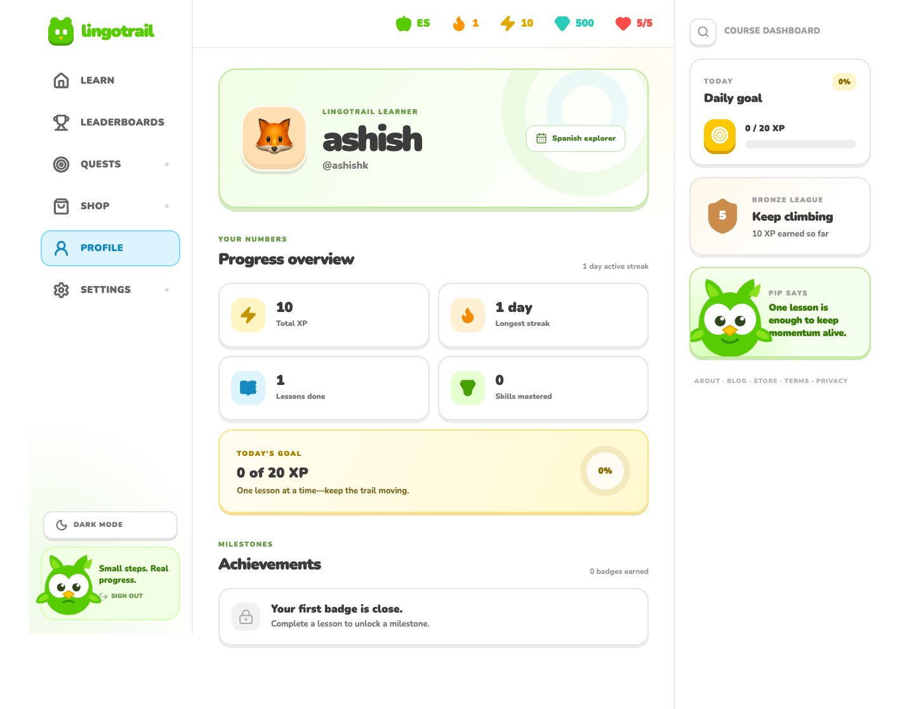

# LingoTrail - Duolingo-Inspired Language Learning Platform

A full-stack web application that recreates Duolingo's core learning loop. Learners can create an account, complete varied exercises, earn XP, maintain streaks, manage hearts, unlock achievements, and compare progress.


[Live Application](https://lingotrail-scaler.vercel.app) ·
[API Health](https://lingotrail-api-139-59-18-245.sslip.io/api/v1/health) ·
[GitHub Repository](https://github.com/ashishbaberwal/duolingo-clone)

## Table of Contents

- [Overview](#overview)
- [Key Features](#key-features)
- [System Architecture](#system-architecture)
- [Database Design](#database-design)
- [Installation](#installation)
- [Usage](#usage)
- [API Documentation](#api-documentation)
- [Project Structure](#project-structure)
- [Business Logic](#business-logic)

## Overview

LingoTrail demonstrates a modern, gamified language-learning workflow with database-backed course content, learner-specific progression, server-validated answers, and persistent rewards.

### Problem Statement

- Static quiz pages do not provide meaningful learner progression
- Client-side answer checking can be manipulated
- XP, streaks, hearts, and unlocked skills must remain consistent
- Progress must belong to the authenticated learner across sessions
- A learning product needs clear feedback, motivation, and recovery states

### Solution

FastAPI owns lesson rules and persistence while Next.js renders the interactive course path and lesson player. SQLite stores content, attempts, progress, daily activity, and achievements for every learner.




## Key Features

### Core Functionality

- **Learning Path**: Ordered units and skills with completed, available, and locked states
- **Five Exercise Types**: Multiple choice, word bank, match pairs, fill-in-the-blank, and typed answers
- **Immediate Feedback**: Correct and incorrect feedback bars with explanations
- **Progress Tracking**: Lesson progress, skill rings, crowns, and prerequisite-based unlocking
- **Learner Accounts**: Independent signup, login, session, and progress data

### Advanced Features

- **Gamification System**: Persistent XP, streaks, hearts, gems, and daily goals
- **Achievements**: Automatically awarded badges with one-time XP bonuses
- **Dynamic Leaderboard**: Seeded competitors plus the authenticated learner's current rank
- **Resumable Attempts**: An unfinished lesson continues from the next unanswered exercise
- **Dark Mode**: Persistent light and dark themes with operating-system fallback

### Security & Data Management

- **Protected Answers**: Canonical answers are excluded from public lesson responses
- **Secure Authentication**: Argon2id password hashes and signed HttpOnly session cookies
- **Data Integrity**: Ownership checks, relational constraints, and recoverable error states

## System Architecture

### Technology Stack

- **Frontend**: Next.js 16, React 19, TypeScript, TanStack Query, CSS Modules, Tailwind CSS 4, Motion, and Lucide React
- **Backend**: Python 3.12, FastAPI, Pydantic, Uvicorn, and layered route-service-repository architecture
- **Database**: SQLite, SQLAlchemy 2, Alembic migrations, and an idempotent seed service
- **Tooling**: Turborepo, pnpm workspaces, uv, Vitest, Testing Library, pytest, Ruff, MyPy, and ESLint
- **Deployment**: Vercel frontend plus DigitalOcean backend with Caddy and systemd

### System Flow

```text
Browser (Next.js)
        ↓
Typed API Client + TanStack Query
        ↓
FastAPI Routes → Pydantic Schemas
        ↓
Application Services → Business Rules
        ↓
Repositories → SQLAlchemy Session
        ↓
SQLite Database
```

In production, Next.js proxies `/api` to DigitalOcean so the authentication cookie remains first-party.

## Database Design

### Entity Relationship Model

```text
Course (1:N) → Units (1:N) → Skills (1:N) → Lessons (1:N) → Exercises
                              ↑
                       Skill Prerequisites

Users (1:N) → Skill Progress
Users (1:N) → Lesson Attempts (1:N) → Attempt Answers
Users (1:N) → Daily Activity
Users (N:M) → Achievements
```

### Key Entities

- **Content**: Courses, units, skills, prerequisites, lessons, exercises, and options
- **Learners**: Identity, hearts, gems, XP, and streak summaries
- **Progress**: Skill completion, crowns, unlock state, and daily activity
- **Attempts**: Resumable attempts and auditable submitted answers
- **Achievements**: Badge definitions and learner awards

### Database Constraints

- Unique learner identity, ordered content positions, answers, and progress rows
- Check constraints for hearts, XP, crowns, counts, and positions
- Foreign keys and cascades preserve relational consistency
- Indexed relationship columns support common path and attempt queries

## Installation

### Prerequisites

- Node.js 22.x
- pnpm 11.x
- Python 3.12
- uv Python package manager
- Git version control

### Setup Process

1. **Clone Repository**

   ```bash
   git clone https://github.com/ashishbaberwal/duolingo-clone.git
   cd duolingo-clone
   ```

2. **Install JavaScript Dependencies**

   ```bash
   pnpm install
   ```

3. **Install Backend Dependencies**

   ```bash
   cd backend
   uv sync
   cd ..
   ```

4. **Configure Backend Environment**

   ```bash
   cp backend/.env.example backend/.env
   ```

   Set `APP_ENV`, `FRONTEND_ORIGIN`, `DATABASE_URL`, `AUTH_SECRET_KEY`, and `AUTH_COOKIE_NAME` in `backend/.env`.

5. **Configure Frontend Environment**

   ```bash
   cp frontend/.env.example frontend/.env
   ```

   Set `NEXT_PUBLIC_API_URL` and `NEXT_PUBLIC_AUTH_COOKIE_NAME` in `frontend/.env`.

6. **Prepare Database**

   ```bash
   pnpm db:migrate
   pnpm db:seed
   ```

7. **Start Development Servers**

   ```bash
   pnpm dev
   ```

8. **Access Application**

   - Frontend: http://localhost:3000
   - Signup: http://localhost:3000/signup
   - FastAPI documentation: http://localhost:8000/docs
   - Backend API: http://localhost:8000/api/v1

There is no shared default account. Register at `/signup`, then log in with those credentials.

## Usage

### For Learners

1. **Create Account**: Register with a display name, username, email, and strong password
2. **Sign In**: Start a signed session using the registered credentials
3. **Choose a Skill**: Select the first available node on the learning path
4. **Complete Exercises**: Submit answers and receive immediate feedback
5. **Manage Hearts**: Lose a heart on mistakes or use the mocked refill
6. **Earn Rewards**: Gain XP, maintain a streak, unlock crowns and achievements
7. **Track Progress**: Review statistics on the learner profile
8. **Compare Rank**: View the live XP leaderboard

### System Workflow

1. Seed data creates the course, exercises, achievements, and leaderboard competitors
2. A registered learner receives an independent profile and progress state
3. The backend calculates skill availability from completed prerequisites
4. Starting a lesson creates or resumes an in-progress attempt
5. Answers are validated privately; mistakes reduce persistent hearts
6. Completion updates XP, streak, progress, and achievements transactionally
7. The frontend invalidates cached queries and displays the new state

## API Documentation

All endpoints are versioned under `/api/v1`. Protected routes require the `lingotrail_session` HttpOnly cookie.

### Core Endpoints

```text
POST   /api/v1/auth/register                   # Create learner account
POST   /api/v1/auth/login                      # Authenticate and set cookie
GET    /api/v1/auth/me                         # Retrieve current learner
POST   /api/v1/auth/logout                     # Clear current session

GET    /api/v1/path                            # Retrieve learner's course path
GET    /api/v1/lessons/{lessonId}              # Retrieve public lesson content
POST   /api/v1/lessons/{lessonId}/attempts     # Start or resume lesson attempt
POST   /api/v1/attempts/{attemptId}/answers    # Validate one exercise answer
```

### Supporting Endpoints

```text
POST   /api/v1/hearts/refill                   # Restore learner hearts
GET    /api/v1/profile                         # Retrieve profile and achievements
GET    /api/v1/leaderboard                     # Retrieve ranked learners
GET    /api/v1/health                          # Check API availability
GET    /docs                                   # Open interactive Swagger UI
```

## Project Structure

```text
duolingo-clone/
├── .github/
│   ├── assets/                   # README application screenshots
│   └── workflows/               # Backend deployment workflow
├── frontend/
│   ├── src/
│   │   ├── app/                  # Next.js routes
│   │   ├── components/           # Shared UI
│   │   ├── features/             # Feature modules
│   │   ├── lib/api/              # Typed API client
│   │   └── providers/            # React providers
│   ├── .env.example
│   └── package.json
├── backend/
│   ├── app/
│   │   ├── api/routes/           # HTTP endpoints
│   │   ├── models/               # Database models
│   │   ├── repositories/         # Database queries
│   │   ├── schemas/              # API contracts
│   │   ├── seed/                 # Seed data
│   │   └── services/             # Business rules
│   ├── migrations/               # Schema versions
│   ├── tests/                    # Backend tests
│   ├── .env.example
│   └── pyproject.toml
├── deploy/digitalocean/          # Deployment files
├── package.json                  # Workspace commands
├── pnpm-workspace.yaml
└── turbo.json
```

## Business Logic

### Progression Rules

- A skill is available when it has no prerequisites or all prerequisites are complete
- Completing every lesson in a skill marks it complete and awards a crown

### Lesson Rules

- Learners can resume only their own active attempt
- Exercises are answered in order and only once per attempt
- Correct answers remain private until server-side evaluation
- Mistakes remove hearts; zero hearts fails the attempt

### Gamification Rules

- Final completion awards lesson XP and records daily activity
- Consecutive activity increments the streak; a gap resets the current streak
- Achievement rewards are granted once per learner and badge

### Data Integrity

- Completion updates attempts, rewards, and progress before one database commit
- Domain failures become safe HTTP responses and learner-friendly UI errors

## Development Features

### Quality & Testing

- `pnpm check` runs linting, strict type checks, 74 tests, and production builds
- Tests cover APIs, authentication, progression, lessons, UI states, and themes

### Error Handling

- Pydantic rejects malformed input before business logic runs
- Services raise typed domain errors and routes map them to HTTP responses
- Database failures roll back; the frontend provides recovery states

### Performance Considerations

- TanStack Query caches server state and mutations invalidate affected keys
- Frequently joined foreign keys are indexed
- Caddy compresses responses; Redis caching and rate limiting are future upgrades

---

## Author

**Ashish Baberwal**

- GitHub: [@ashishbaberwal](https://github.com/ashishbaberwal)
- Project Repository:
  [LingoTrail](https://github.com/ashishbaberwal/duolingo-clone)

## License

Developed for the Scaler AI full-stack internship assignment and educational demonstration.
