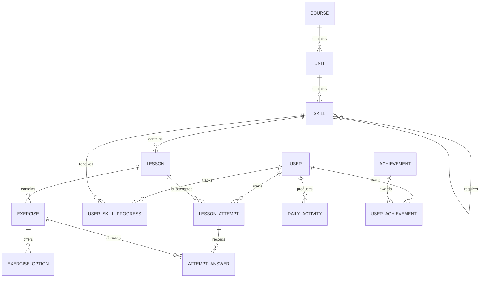

# Database schema

The SQLite schema separates immutable course content, mutable learner state,
and the audit trail created while a learner completes lessons.

## Content tables

### `courses`

One language course, identified by a stable code such as `es-en`. Language
names live here rather than being repeated across units and lessons.

### `units`

Ordered sections inside a course. `(course_id, position)` is unique, which
prevents two units from occupying the same path position.

### `skills`

Ordered learning topics inside a unit. Skills do not contain a `locked` flag:
lock state is learner-specific and belongs in `user_skill_progress`.

### `skill_prerequisites`

A self-referencing many-to-many join table between skills. A skill may require
multiple earlier skills, and one completed skill may unlock multiple branches.
The composite primary key prevents duplicate prerequisite edges, while a check
constraint prevents a skill from requiring itself.

### `lessons`

Ordered sessions within a skill. Each lesson defines its XP reward. Lesson
completion is user-specific and is recorded through attempts and progress.

### `exercises`

Stores the fields shared by all exercise types: type, instruction, prompt,
position, explanation, and canonical answer. `answer_data` is JSON for the
small amount of exercise-specific structure that does not justify a separate
table.

Supported types are constrained to:

- `multiple_choice`
- `word_bank`
- `match_pairs`
- `fill_blank`
- `type_answer`

### `exercise_options`

Normalizes selectable answers instead of embedding all choices in an exercise
JSON document. Multiple-choice correctness and match-pair metadata live here.

## Learner tables

### `users`

Stores the simplified default learner and seeded leaderboard users. Hearts,
gems, total XP, streak summaries, timezone, and daily goal live here because
they are read on almost every page.

Database checks prevent invalid states such as negative XP, negative hearts, or
hearts exceeding the configured maximum.

### `user_skill_progress`

One row per user and skill. It records whether a skill is unlocked or completed,
completed lesson count, crowns, and completion time. The unique user/skill pair
prevents duplicate progress records.

### `daily_activity`

One row per learner per local activity date. It stores daily XP and lesson
count, supporting daily goals and testable streak calculations.

### `achievements` and `user_achievements`

Achievements are reusable definitions. The join table records which learner
earned which achievement and when. Its unique pair prevents an achievement
from being awarded twice.

## Attempt audit tables

### `lesson_attempts`

Represents one learner session for one lesson. It stores status, starting and
remaining hearts, answer totals, XP awarded, and timing information.

Attempt status is constrained to:

- `in_progress`
- `completed`
- `failed`
- `abandoned`

### `attempt_answers`

Stores one submitted answer per exercise per attempt. The unique
`(attempt_id, exercise_id)` constraint prevents duplicate submissions. Keeping
the submitted value and correctness result gives us an audit trail for
debugging and evaluation.

## Integrity strategy

- Foreign-key enforcement is explicitly enabled for every SQLite connection.
- Parent deletion cascades through owned content and learner-owned records.
- Ordered children use unique parent/position constraints.
- Counts, XP, hearts, and positions use database check constraints.
- Frequently joined foreign keys are indexed.
- All tables use named constraints so Alembic migrations remain readable.
- Timestamps are generated in UTC and declare timezone intent.

The application service layer will still validate friendly business rules.
Database constraints are the final protection against corrupted persisted data.
